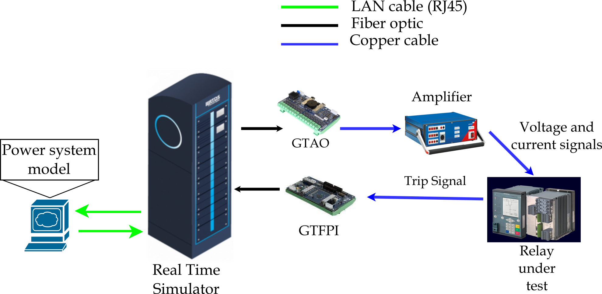

# DESSERT
DESSERT is a MatLab-based application for "DESign and analySis of ExpeRiments for power system Testing".

## Contributors:
Mirko Ginocchi (mirko.ginocchi@eonerc.rwth-aachen.de): Conceptualization, Methodology, Validation, Formal Analysis, Investigation
Maria Lopez Sanchez (maria.lopez.sanchez@rwth-aachen.de): Software, Validation

## Copyright
2024-2025, Maria Lopez Sanchez (RWTH-ACS)  
2018-2025, Mirko Ginocchi (RWTH-ACS)  
2025, Institute for Automation of Complex Power Systems, EONERC

## License
 This work is licensed under a <a rel="license" href="http://creativecommons.org/licenses/by/4.0/">Creative Commons Attribution 4.0 International License</a>.

## Contact

- [Mirko Ginocchi, M.Sc.](mailto:mirko.ginocchi@eonerc.rwth-aachen.de)

[Institute for Automation of Complex Power Systems (ACS)](http://www.acs.eonerc.rwth-aachen.de)  
[E.ON Energy Research Center (EONERC)](http://www.eonerc.rwth-aachen.de)  
[RWTH University Aachen, Germany](http://www.rwth-aachen.de)
